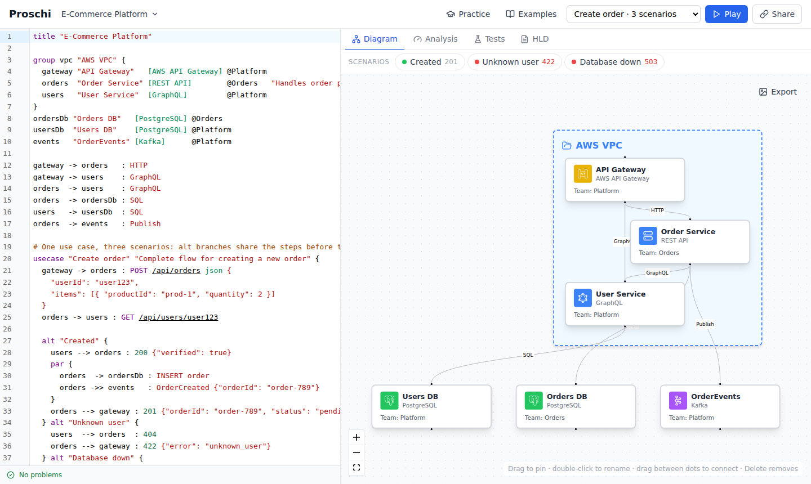

# Proschi

Proschi is a small text language for architecture diagrams and high-level
designs. You write the nodes, connections and request flows of a system as
plain text; Proschi lays out the diagram, animates every use case step by step,
and runs a deterministic simulation (load, latency, availability, cost) that
checks the design against the requirements and tests you write next to it. The
same parser runs in the browser, on the command line, in the language server
and in VS Code, so they always agree on what is valid.

```proschi
title "Notes"

user "User"      [Actor]
api  "Notes API" [REST API]   @backend
db   "Notes DB"  [PostgreSQL] @backend

user -> api : HTTPS
api  -> db  : SQL

# -> request, --> response, ->> fire-and-forget
usecase "Create a note" {
  user -> api  : POST /notes json {"text": "Buy milk"}
  api  -> db   : INSERT note
  db  --> api  : 1 row
  api --> user : 201 {"id": 42}
}

traffic {
  "Create a note" 200 rps
}

requirements {
  p99 "Create a note" < 200ms
}

test "Notes are stored before they are returned" {
  "Create a note" writes any database before responding
}
```



## Features

- **Language**: nodes with tech stacks and owner teams, groups, connections,
  use cases with requests, responses, fire-and-forget calls, `par` blocks and
  failed calls, multi-file documents with `import`, and a formatter.
  See the [language reference](docs/LANGUAGE.md).
- **Editor**: a browser-only editor with highlighting, completion, live
  diagnostics and automatic layout; share links, saved documents, PNG/SVG and
  Mermaid export. Nothing is uploaded.
- **Playback**: every use case plays as an animation over the diagram, step by
  step, with links to individual steps.
- **Scenarios**: `alt` branches and `when "…"` conditions describe the happy
  path and the failures of a use case side by side.
- **HLD and simulation**: traffic, requirements, replicas, shards, capacity,
  entities and decisions turn a diagram into a high-level design document; the
  simulation computes load, latency, availability and cost per node and runs
  your requirements and tests. [How the simulation works](https://gvart.github.io/proschi/model/)
  lists its formulas, its default numbers and what it leaves out.
- **Practice**: system design problems (URL shortener, payments, chat, video
  streaming and more) whose tests tell you in the browser whether your design
  holds up.
- **CLI, LSP and VS Code**: `proschi check`, `fmt`, `render`, `test`,
  `analyze` and `problem` for CI; a language server for any LSP editor; a VS
  Code extension with a diagram preview. Use case steps can also be checked
  against OpenAPI specs. See [editor support](docs/EDITORS.md).

## Links

| | |
|---|---|
| Website | <https://gvart.github.io/proschi/> |
| Editor | <https://gvart.github.io/proschi/app/> |
| Practice | <https://gvart.github.io/proschi/practice/> |
| How the simulation works | <https://gvart.github.io/proschi/model/> |
| npm package (CLI and language server) | [`proschi`](https://www.npmjs.com/package/proschi) |
| VS Code extension (`.vsix`) | [GitHub releases](https://github.com/gvart/proschi/releases) |
| Language reference | [docs/LANGUAGE.md](docs/LANGUAGE.md) |
| Editor support, CLI, CI | [docs/EDITORS.md](docs/EDITORS.md) |
| Writing practice problems | [docs/PRACTICE.md](docs/PRACTICE.md) |
| Design: HLDs and the practice platform | [docs/design/hld-and-practice.md](docs/design/hld-and-practice.md) |
| Changelog | [CHANGELOG.md](CHANGELOG.md) |

## Quick start

Open the [editor](https://gvart.github.io/proschi/app/), pick one of the
Examples and edit the text; the diagram, scenarios, Analysis, Tests and HLD
tabs follow as you type.

On the command line (Node 18 or newer):

```sh
npx proschi check docs/            # errors and warnings for every *.proschi file
npx proschi fmt --check docs/      # exit 1 if a file is not formatted
npx proschi test docs/             # run requirements and tests
npx proschi render notes.proschi --out diagrams   # SVG diagrams
```

For VS Code, download `proschi-<version>.vsix` from the
[latest release](https://github.com/gvart/proschi/releases) and run
`code --install-extension proschi-<version>.vsix`.

## Contributing

The repository has two packages:

- `frontend/`: the website, editor and practice platform (React, Vite). The
  language (`src/dsl`), simulation (`src/sim`) and HLD (`src/hld`) live here.
- `tooling/`: the CLI, language server, TextMate grammar, JSON Schema and VS
  Code extension, bundled from the frontend sources with esbuild.

```sh
# Web app
cd frontend
npm ci
npm run dev        # http://localhost:5173/app/ and /practice/
npm run lint && npx tsc -b && npm test && npm run build

# Tooling
cd tooling
npm ci
npm run typecheck
npm test           # builds dist/ first
node dist/cli.cjs check ../frontend/src/practice/problems
npm run package:vscode   # dist/proschi.vsix
```

A change to the language goes in `frontend/src/dsl/` with tests next to it;
both test suites must pass, since the tooling bundles the same code.

### Adding a practice problem

```sh
cd tooling && npm run build
node dist/cli.cjs problem new seat-map      # scaffolds frontend/src/practice/problems/seat-map/
# write problem.md, given.proschi, starter.proschi, solution.proschi and wrong/*.proschi
node dist/cli.cjs problem check             # the solution passes, the starter and wrong designs fail
```

The practice page and the landing page pick up the new folder by themselves.
[docs/PRACTICE.md](docs/PRACTICE.md) explains the files, the rules `problem
check` enforces and how to calibrate the limits. CI runs the same check.

Releases: bump the version in `tooling/package.json` and
`tooling/vscode/package.json`, add a section to the changelog, and push a
`tooling-v<version>` tag (see [Releasing](docs/EDITORS.md#releasing)).

## License

[MIT](LICENSE)
